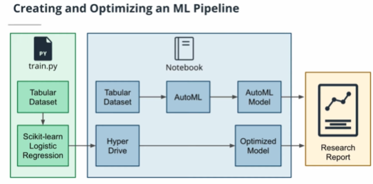
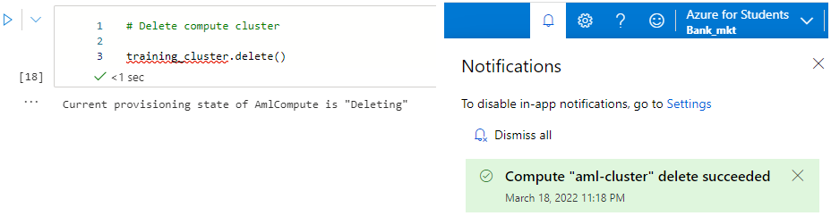

# Optimizing an ML Pipeline in Azure

## Overview
This project is part of the Udacity Azure ML Nanodegree.
In this project, we build and optimize an Azure ML pipeline using the Python SDK and a provided Scikit-learn model.
This model is then compared to an Azure AutoML run.

## Useful Resources
- [ScriptRunConfig Class](https://docs.microsoft.com/en-us/python/api/azureml-core/azureml.core.scriptrunconfig?view=azure-ml-py)
- [Configure and submit training runs](https://docs.microsoft.com/en-us/azure/machine-learning/how-to-set-up-training-targets)
- [HyperDriveConfig Class](https://docs.microsoft.com/en-us/python/api/azureml-train-core/azureml.train.hyperdrive.hyperdriveconfig?view=azure-ml-py)
- [How to tune hyperparamters](https://docs.microsoft.com/en-us/azure/machine-learning/how-to-tune-hyperparameters)


## Summary

The dataset Bank Marketing dataset, contains about 32,950 history of distinct customer rows and 21 features of those customers including class label. We seek to predict a customer will default on loan payment or not.

We seek to create and optimize an ML Pipeline using this dataset by:

* Optimize custom model with HyperDrive
* Optimize using Automated machine learning(AutoML)


And Compare the results of the 2 methods


In both AUC and Accuracy, AutoML performed better than HyperDrive.

## Scikit-learn Pipeline

**Data**

Data Preprocessing and Training step are located in the python script "train.py"

* Tabular dataset was created from the URL path using 

```python 
TabularDatasetFactory.from_delimited_files(..)
```
* Data cleaning was performed:
With 10 integers variables, 11 object variables including the class label, cleaning /one_hot encoding was performed. rows with NaN values where droped. Also one_hot encoding was performed on customer attributes like job, contact and education. for  some variables, string values where mapped to integer values. These attributes includes, marital, default e.t.c

* Spliting ratio 70:30 was used, with test data having 30% of the data.

* The model was scored based on accuracy and AUC.


**HyperDrive**

classification algorithm used is Logistic regression with the objective of minimizing loss function with respect to the coefficients of customer features like age, job,  housing e.t.c. 
I used 2 hyperparameter, "C and max_iter". Parameter  **C** which helps to combat overfiting, smaller value of **C** results to stronger regularization by penalizing large values of coefficient and max_iter hyperparameter which helps the solver to converge thus getting the global optimum of minimized loss function.


I set the search space for C with continuous hyperparameter "uniform distribution" from 0.005 to 0.01. While max_iter was set with discrete hyperparameter 70,100 and 130.

**What are the benefits of the parameter sampler you chose?**

I Used Random sampling which randomly selects the a value for each hyperparameter I defined, in this case, Regularization and maximum iteration parameters.
This sampling technique saved me time, but can be a little bit less accurate due to smaller search space.

```python
RandomParameterSampling({
        "--C": uniform(0.005, 0.01),
        "--max_iter":choice(70, 100,130) 
     } )
```

**What are the benefits of the early stopping policy you chose?**
Early stopping policy used was Bandit policy, this policy saves me time by stopping a run if a criteria like slack_amount is not met. 

```python
BanditPolicy(slack_amount = 0.2,
                                        evaluation_interval=1,
                                        delay_evaluation=5)
```
In the above policy, for every first five iteration, the bandit policy is applied, it stops run if the target metric is 0.2 worse than the best performing run.


**Scikit-learn Pipeline**

Environment.from_conda_specification(...) helps to create a Python environment for the experiment (from conda_dependencies.yml)

inside this yml file contains some dependencies like python,scikit-learn numpy and pandas.

```python
sklearn_env = Environment.from_conda_specification(name='sklearn-env', file_path=experiment_folder +'/conda_dependencies.yml')

# Create a ScriptRunConfig Object to specify the configuration details of your training job
src = ScriptRunConfig(source_directory=experiment_folder,
                                script='train.py',
                                compute_target = training_cluster,
                                environment=sklearn_env)

# Create a HyperDriveConfig using the src object, hyperparameter sampler, and policy.
hyperdrive_config = HyperDriveConfig(run_config=src,#estimator=est,
                                     hyperparameter_sampling=ps,
                                     policy=policy,
                                     primary_metric_name='Accuracy',
                                     primary_metric_goal=PrimaryMetricGoal.MAXIMIZE,
                                     max_total_runs=6,
                                     max_concurrent_runs=4
                                     )
```
ScriptRunConfig that identifies the Python script file to be run in the experiment, and then run an experiment based on it, it also determines compute and python environment defined in the conda yml file.

HyperDriveConfig object is used to prepare the hyperdrive experiment. You can create HyperDriveConfig using the ScriptRunConfig object, hyperparameter sampler, and policy. Aim of the Experiment is to maximize Accuracy. max_total_runs set to 6, I restict the experiment to 6 iterations. Also, max_concurrent_run=2, run up to 2 iterations in parallel.

## AutoML

* Use TabularDatasetFactory to load the same dataset in the notebook.
* Use AutoML to find, train and tune a model.

**AutoML**

* In AutoML config here, you can set the maximum time for experiment. Here it is 30 minutes.
* task is classification as we have to classify if a customer will default or not.
* Primary metric here is accuracy same as hyperdrive.
* ds_frame is the tabular dataset converted to dataframe.
It also takes in parameters for label column name and number of cross validations. 

```python
AutoMLConfig(
    experiment_timeout_minutes=30,
    task="classification",
    primary_metric="accuracy",
    training_data=ds_frame,
    label_column_name="y",
    n_cross_validations=5)
```
Other parameters of AutoMLConfig includes:
compute_target,validation_data,featurization,iterations and max_concurrent_iterations.

**Best Model**

VotingEnsemble was the best model selected by AutoML. This is the sum of predictions from other classification algorithms, e.g. LightGBMClassifier,XGBoostClassifier,LogisticRegression e.t.c voting used in voting. e.g. AutoML used 10 ML Algorithms to participate in VotingEnsemble, each with there ensemble weights and hyperparameters.

## Pipeline comparison

**Accuracy**

* HyperDrive
bankmarketing_model version: 2
	 Regularization Strength: : 0.00551584512091742
	 Max iterations: : 100
	 Accuracy : 0.9151239251390997
	 AUC : 0.9269997696302712

* AutoML
automl_bankmarketing_model version: 1
	 Training context : Auto ML
     AUC : 0.9475641425618313
	 Accuracy : 0.9176631259484067

The performace of AutoML is better for both AUC and Accuracy metrics.

**Architecture**

AutoML Architecture is simpler when compared with HyperDrive. 
* In HyperDrive, I have to do some Feature Engineering, Hyperparameter selection, Training and Tuning, but these steps are Automated with AutoML.
* with AutoML, you can create hundreds of models a day,can get better model accuracy and deploy models faster.

**Differences**

* Reason for difference between AutoML and HyperDrive Architecture is that you need to fix several parameters in HyperDrive, while that is AutoML is already automated for several Machine learning algorithms.

## Future work

**HyperDrive**
  * Use Larger Search space
  * Use Grid Sampling to try every posible combinations of hyperparameters.
  * Try other Machine LearningAlgorithms and take the best.
  
**AutoML**
  * Increase the Experiment time out to choose the best algorithm.  

## Proof of cluster clean up

```py
training_cluster.delete()
```

